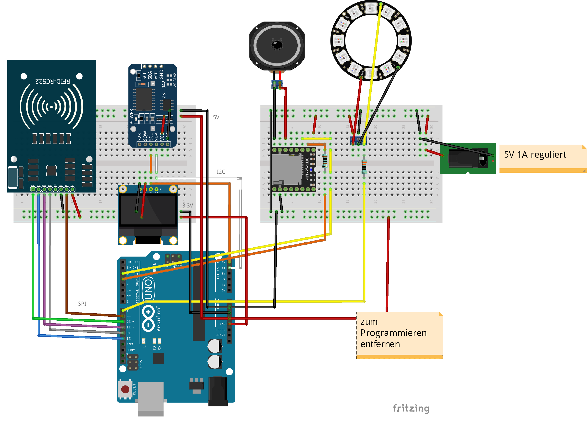

# Lichtwecker mit Arduino

Dieses Projekt entstand im Rahmen des Masterstudiengangs Internationale Medieninformatik an der HTW Berlin.

Entstanden ist ein Lichtwecker für Kinder, welcher mittels RFID (MIFARE) gesteuert wird.

## Komponenten ##
* Arduino Uno
* RFID-Lesegerät MFRC522
* Real-Time-Clock DS3231
* Display (OLED 1,3" 128x64)
* DFPlayer Mini (Mp3-Player)
* Mini-Lautsprecher 2Ohm(?)
* NeoPixel-Ring mit 24 RGB-LEDs
* Kleinkram: Widerstände, Buchsenleisten, kabel, Lötzubehör, ...

## Aufbau ##
